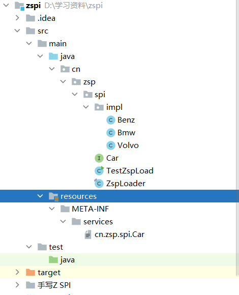
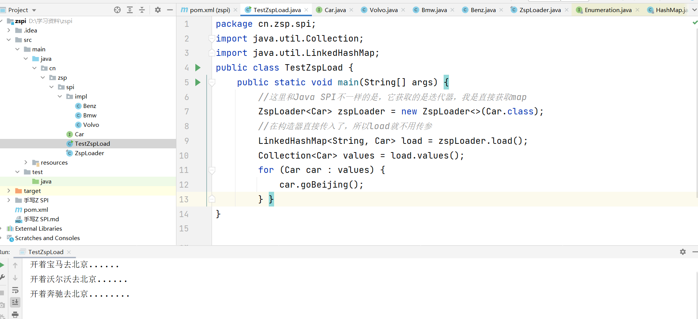

# 手写SPI

​	最近看了很多源码，例如Java SPI，Dubbo SPI等，光看源码手挺痒痒的，就想着自己造造轮子。这是我第一次造轮子，选择模仿的对象是Java SPI，原因有两个：

* 看完Dubbo SPI后，感觉Java SPI难度尚可，且流程我较为熟悉。
* Java SPI尝试手写完成后，我可以再试一试Dubbo SPI。

手写过程我会通过这个笔记记录下来，希望以后的自己可以看到（主要是记性不好）。

如果这篇文章有其他人看，也想知道这么写的，可以先看我先前的Java SPI运用和源码解析再来看这个。

## 整体流程

要仿着造轮子，肯定得对程序执行的一个流程有个清晰的了解，所以这里来讲下整个流程：

* 首先我们要先传入要实现的接口
  * 主要为了得到类加载器 
  * 判断加载的类是否实现了该接口
* 然后我们要读取配置文件（即META-INF/services/+接口全名，例如：META-INF/services/cn.zsp.spi.Car）
  * 应该有个写死的路径加上接口的全名，或者让用户自行提供（建议写死）
  * 先去除#号后的数据，然后去除前后空格，一行一行读取
  * 使用集合存储所有的生成类名
*  使用反射，通过先前传入的接口获取到的类加载器生成类
* 以配置文件名和对象为键值存入缓存，最后返回对象

至此，整个流程就讲完了，下面我开始实现，期间应该会比较生疏，望见谅。


## 代码示例

​	提示一下，一定要把Java SPI源码看完，然后再把上面流程看完，再来看这里，不然可能事倍功半。

* 先看一下总体目录，我实现的SPI只有ZspLoader那个类



### 整体代码

先给各位看下整体代码，然后再来拆起来分析下。

* ZspLoader的代码如下：

```java
/**
 * @author zsp
 * @version 1.0
 * @date 2021/11/26 15:44
 * 只是仿造Java SPI源码造的轮子，没有考虑多线程
 * 安全策略等问题，后续会继续完善
 */
public final class ZspLoader<S>  {
    //写死读取配置文件的路径
    private static final String PREFIX = "META-INF/services/";
    //获取类对象
    private  Class<S> service;
    //获取类加载器
    private  ClassLoader loader;
    // 缓存，键是配置文件的实现类名字，值是反射获取的对象
    private LinkedHashMap<String,S> cacheObjectMap = new LinkedHashMap<>();
    // 缓存，存储已经生成过的对象，键是接口名字，值是反射对象的集合
    private HashMap<String,LinkedHashMap<String, S>> cacheInterfaceMap=new HashMap<String,LinkedHashMap<String, S>>() ;
    //用于存储配置文件位置
    Enumeration<URL> configs;

    public ZspLoader(Class<S> service) {
        //直接获取到传参
        this.service = service;
        this.loader = service.getClassLoader();
    }
    public <S> LinkedHashMap<String,S> load(){

         if (cacheInterfaceMap!=null&&!cacheInterfaceMap.isEmpty()){
            LinkedHashMap<String, S> linkedHashMap = (LinkedHashMap<String, S>) cacheInterfaceMap.get(service.getName());
            return linkedHashMap;
        }
        ClassLoader cl = Thread.currentThread().getContextClassLoader();
        return (LinkedHashMap<String, S>) load(service, cl);
    }

    private  <S> LinkedHashMap<String,S> load(Class<S> service, ClassLoader cl) {
        //判断class是否为空
        service = Objects.requireNonNull(service, "Service interface cannot be null");
        //判断类加载器是否为空，为空则使用系统类加载器
        loader = (cl == null) ? ClassLoader.getSystemClassLoader() : cl;
        //从这里开始执行Java SPI的核心内容

        try {
            //1、使用流获取配置文件中的实现类路径
            ArrayList names=parse();
            //2、使用反射对上述文件记录对象进行生成
            getObject(names);
            //3、返回实现类名和对象的map
            cacheInterfaceMap.put(service.getName(),cacheObjectMap);
           return (LinkedHashMap<String, S>) cacheObjectMap;
        } catch (IOException e) {
            e.printStackTrace();
        }
        return (LinkedHashMap<String, S>) cacheObjectMap;
    }

    private void getObject(ArrayList<String> names) {
        //遍历配置文件中的名字集合
        for (String name : names) {
            try {
                Class<?> c = Class.forName(name, false, loader);
                S p = service.cast(c.newInstance());
                cacheObjectMap.put(name,p);
            } catch (ClassNotFoundException e) {
                e.printStackTrace();
            } catch (InstantiationException e) {
                e.printStackTrace();
            } catch (IllegalAccessException e) {
                e.printStackTrace();
            }
        }

    }

    private ArrayList<String> parse() throws IOException {
        //拼串获取配置文件
        String fullName=PREFIX + service.getName();

        //创建方法集，用来存方法
        ArrayList<String> names = new ArrayList<>();
            if (loader == null) {
                configs = ClassLoader.getSystemResources(fullName);
            } else {
                configs = loader.getResources(fullName);
            }
        URL url = null;
        try {
            url = configs.nextElement();
        } catch (Exception e) {
            throw  new IOException("你的META-INF/services/目录下没有文件！");
        }

        return  parseObjectList(url);
    }

    private ArrayList parseObjectList(URL url) {
        //使用流将配置文件中的所有类位置读取出来
        //获取每一个类是使用parseLine方法
        InputStream in = null;
        BufferedReader r = null;
        ArrayList<String> names = new ArrayList<>();
        try {
            in = url.openStream();
            r = new BufferedReader(new InputStreamReader(in, "utf-8"));
            int lc = 1;
            while ((lc = parseLine(service, url, r, lc, names)) >= 0);
        } catch (IOException e) {
            e.printStackTrace();
        }
        return names;
    }

    private int parseLine(Class<S> service, URL url, BufferedReader r, int lc, ArrayList<String> names) throws IOException {
        //获取类名，需要判断是否含有除了.以外的符号
        String ln=r.readLine();
        if (ln==null)
        {
            return -1;
        }
        int ci=ln.indexOf('#');
        if (ci>=0) ln=ln.substring(0,ci);
        ln=ln.trim();
        int n=ln.length();
        if (ln.indexOf(' ')>0||ln.indexOf('\t')>=0){
            throw new IOException("写个实体类的路径，带空格带换行的算怎么回事");
        }
        int cp =ln.codePointAt(0);
        if(!Character.isJavaIdentifierStart(cp)){
            throw new IOException("写个实体类的路径，开头居然是符号，谁教你这么写的");
        }
        for (int i = Character.charCount(cp); i <n ; i+=Character.charCount(cp)) {
            cp = ln.codePointAt(i);
            if (!Character.isJavaIdentifierPart(cp) && (cp != '.')){
                throw new IOException("写个实体类的路径，中间还有其他符号，回去重学打字吧");
            }
        }
        names.add(ln);
        return lc+1;
    }

}
```

### 要实现的接口

```java
public interface Car {
    void goBeijing();
}
```

### 三个实现接口的方法

* 为了省事三个类写一起了，自行拆开下就可以：

```java
public class Volvo implements Car {
    @Override
    public void goBeijing() {
        System.out.println("开着沃尔沃去北京......");
    }
}

public class Bmw implements Car {
 @Override
 public void goBeijing() {
  System.out.println("开着宝马去北京......");
 }
}

public class Benz implements Car {
    @Override
    public void goBeijing() {
            // TODO Auto-generated method stub
            System.out.println("开着奔驰去北京........");
    }
}

```

### 创建配置类

* 千万要记得！千万要记得，在resources下创建META-INF文件夹，在创建services文件夹，然后创建cn.zsp.spi.Car：

```
cn.zsp.spi.impl.Bmw
cn.zsp.spi.impl.Volvo
cn.zsp.spi.impl.Benz
```

### 实现方法

```java
package cn.zsp.spi;
import java.util.Collection;
import java.util.LinkedHashMap;
/**
 * @author zsp
 * @version 1.0
 * @date 2021/11/26 15:44
 * 这是我第一次造轮子，先拿最熟悉的Java SPI开刀
 * 后续将实现IOC再去考虑实现Dubbo SPI，各位共勉
 */
public class TestZspLoad {
    public static void main(String[] args) {
        //这里和Java SPI不一样的是，它获取的是迭代器，我是直接获取map
        ZspLoader<Car> zspLoader = new ZspLoader<>(Car.class);
        //在构造器直接传入了，所以load就不用传参
        LinkedHashMap<String, Car> load = zspLoader.load();
        Collection<Car> values = load.values();
        for (Car car : values) {
            car.goBeijing();
        }

    }
}
```

最终实现效果：可以看到我没有引入实现类依赖，但是可以创建出实现类，证明是可以的。



## 解析代码

没想到有一天也能解析我自己写的代码，真是另有一种感觉，先从主方法开始，点击方法：ctrl+左键。

* 进入主方法查看，点击ZspLoader的构造方法查看。

```java
public class TestZspLoad {
    public static void main(String[] args) {
        //这里和Java SPI不一样的是，它获取的是迭代器，我是直接获取map
        ZspLoader<Car> zspLoader = new ZspLoader<>(Car.class);
        //在构造器直接传入了，所以load就不用传参
        LinkedHashMap<String, Car> load = zspLoader.load();
        Collection<Car> values = load.values();
        for (Car car : values) {
            car.goBeijing();
        } }
}
```

* 构造器一定要记得，获取到我们需要的参数：类和类加载器

```java
    public ZspLoader(Class<S> service) {
        //直接获取到传参
        this.service = service;
        this.loader = service.getClassLoader();
    }
```

* 然后再返回到主方法查看load方法：
  * 返回了对象列表，key是类名，v是实现类

```java
    public <S> LinkedHashMap<String,S> load(){
        //判断缓存是否存在，不存在则重新创建获取
         if (cacheInterfaceMap!=null&&!cacheInterfaceMap.isEmpty()){
            LinkedHashMap<String, S> linkedHashMap = (LinkedHashMap<String, S>) cacheInterfaceMap.get(service.getName());
            return linkedHashMap;
        }
        ClassLoader cl = Thread.currentThread().getContextClassLoader();
        return (LinkedHashMap<String, S>) load(service, cl);
    }
```

* 在点击传参的load(service, cl)继续深入，接下去的问题就好解决了，分为三步：
  * 使用流获取配置文件中的实现类路径
  * 使用反射对上述文件记录对象进行生成
  * 返回实现类名和对象的map

```java
    private  <S> LinkedHashMap<String,S> load(Class<S> service, ClassLoader cl) {
        //判断class是否为空
        service = Objects.requireNonNull(service, "Service interface cannot be null");
        //判断类加载器是否为空，为空则使用系统类加载器
        loader = (cl == null) ? ClassLoader.getSystemClassLoader() : cl;
        //从这里开始执行Java SPI的核心内容
        try {
            //1、使用流获取配置文件中的实现类路径
            ArrayList names=parse();
            //2、使用反射对上述文件记录对象进行生成
            getObject(names);
            //3、返回实现类名和对象的map
            cacheInterfaceMap.put(service.getName(),cacheObjectMap);
           return (LinkedHashMap<String, S>) cacheObjectMap;
        } catch (IOException e) {
            e.printStackTrace();
        }
        return (LinkedHashMap<String, S>) cacheObjectMap;
    }
```

#### 1、获取配置文件的实现类路径

* 进入parse方法：
  * 拼串，获取配置文件的位置
  * 将配置文件位置传入parseObjectList方法中

```java
private ArrayList<String> parse() throws IOException {
        //拼串获取配置文件
        String fullName=PREFIX + service.getName();
        //创建方法集，用来存方法
        ArrayList<String> names = new ArrayList<>();
            if (loader == null) {
                configs = ClassLoader.getSystemResources(fullName);
            } else {
                configs = loader.getResources(fullName);
            }
        URL url = null;
        try {
            url = configs.nextElement();
        } catch (Exception e) {
            throw  new IOException("你的META-INF/services/目录下没有文件！");
        }
        return  parseObjectList(url);
    }
```

* 接着进入parseObjectList方法中，查看怎么获取到配置文件下所有的类名的

```java
private ArrayList parseObjectList(URL url) {
    //使用流将配置文件中的所有类位置读取出来
    //获取每一个类是使用parseLine方法
    InputStream in = null;
    BufferedReader r = null;
    //创建集合用来存储类名
    ArrayList<String> names = new ArrayList<>();
    try {
        in = url.openStream();
        r = new BufferedReader(new InputStreamReader(in, "utf-8"));
        int lc = 1;
        //循环获取类名放入names中
        while ((lc = parseLine(service, url, r, lc, names)) >= 0);
    } catch (IOException e) {
        e.printStackTrace();
    }
    return names;
}
```

* 使用parseLine获取实现类名，主要实现：
  * 拿到每一行后，先截串，把注释去掉，去头尾空格和换行
  * 判断每一行的字符是否符合

```java
    private int parseLine(Class<S> service, URL url, BufferedReader r, int lc, ArrayList<String> names) throws IOException {
        //获取类名，需要判断是否含有除了.以外的符号
        String ln=r.readLine();
        if (ln==null)
        {
            return -1;
        }
        //截串
        int ci=ln.indexOf('#');
        if (ci>=0) ln=ln.substring(0,ci);
        ln=ln.trim();
        int n=ln.length();
        if (ln.indexOf(' ')>0||ln.indexOf('\t')>=0){
            throw new IOException("写个实体类的路径，带空格带换行的算怎么回事");
        }
        int cp =ln.codePointAt(0);
        if(!Character.isJavaIdentifierStart(cp)){
            throw new IOException("写个实体类的路径，开头居然是符号，谁教你这么写的");
        }
        for (int i = Character.charCount(cp); i <n ; i+=Character.charCount(cp)) {
            cp = ln.codePointAt(i);
            if (!Character.isJavaIdentifierPart(cp) && (cp != '.')){
                throw new IOException("写个实体类的路径，中间还有其他符号，回去重学打字吧");
            }
        }
        names.add(ln);
        return lc+1;
    }

```

#### 2、使用反射生成实现类对象

* 进入 getObjec方法

```3java
 private void getObject(ArrayList<String> names) {
        //遍历配置文件中的名字集合
        for (String name : names) {
            try {
                //使用反射生成遍历
                Class<?> c = Class.forName(name, false, loader);
                //使用cast方法，把生成的object对象设置为和service相同的泛型
                S p = service.cast(c.newInstance());
                cacheObjectMap.put(name,p);
            } catch (ClassNotFoundException e) {
                e.printStackTrace();
            } catch (InstantiationException e) {
                e.printStackTrace();
            } catch (IllegalAccessException e) {
                e.printStackTrace();
            }
        }

    }
```

#### 3、返回实现类名和对象的map

```java
 cacheInterfaceMap.put(service.getName(),cacheObjectMap);
return (LinkedHashMap<String, S>) cacheObjectMap;
```

至此我仿写的Java SPI写完了，整体和Java SPI有所不同，且没有考虑到多线程问题，但大体算是实现了。

往后还会造更多的轮子，加强自己的基础知识和对框架的理解。

